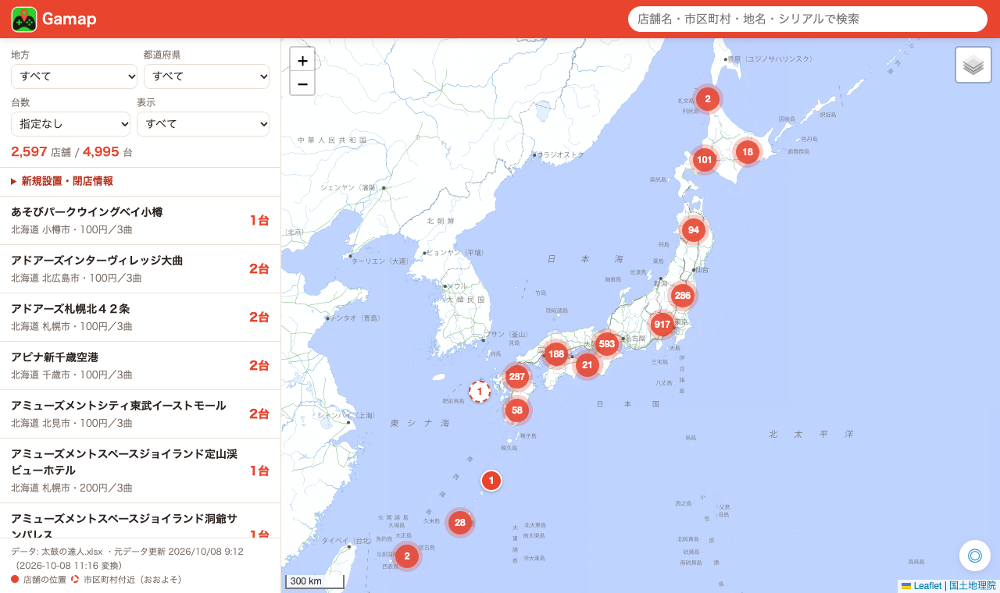
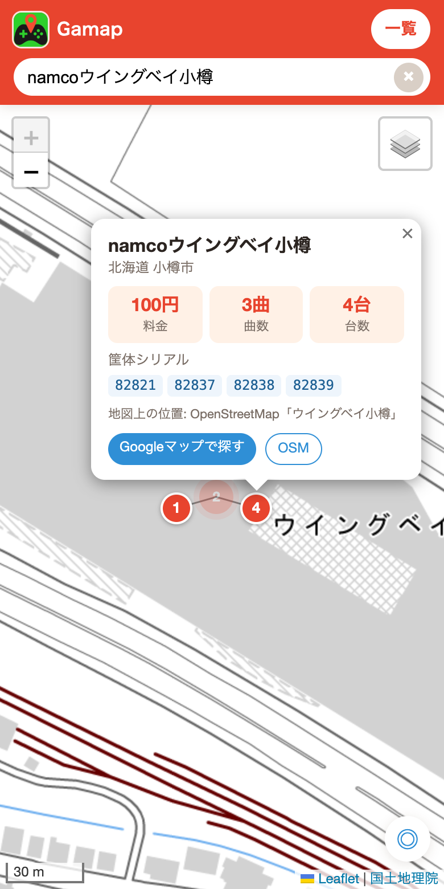

# Gamap

**太鼓の達人の設置店舗を地図で探せる Web アプリ**です。全国約 2,600 店舗の筐体情報（料金・曲数・台数・シリアル番号）を、地図上のピンから確認できます。

### 👉 [Gamap を開く](https://nisimodo.github.io/Gamap_CC-/)

https://nisimodo.github.io/Gamap_CC-/

<p>
  
  
</p>

## できること

- **地図で探す** … 全国の設置店舗をピンで表示します。ピンの数字は台数です。
- **筐体情報を見る** … ピンを押すと、料金・曲数・台数・筐体シリアル・備考（閉店予定など）が表示されます。
- **検索する** … 店舗名・市区町村・シリアル番号で検索できます。「恵比寿」「東行田」のような地名・駅名で検索すると、その周辺の店舗を近い順に表示します。
- **絞り込む** … 地方・都道府県・台数（2 台以上など）・情報募集中・閉店予定で絞り込めます。
- **周辺検索** … ヘッダーの「周辺検索」で、現在地から 10km 以内の店舗を近い順に一覧表示します（10km 以内に 10 件ないときは近い順に 10 件）。
- **現在地へ移動** … 右下の ◎ ボタンで現在地へ移動します。
- **新規設置・閉店情報** … 最近設置された店舗や閉店予定の店舗を一覧で確認できます。
- **Google マップで開く** … 店舗のポップアップから Google マップで場所を確認できます。

### ピンの見方

| ピン | 意味 |
| --- | --- |
| 赤い丸 | 店舗（または入居している商業施設）の位置。店舗名に駅名が入っている店舗（「〇〇駅前」など）はその駅の位置 |
| 点線の丸 | 正確な位置が分からないため、**市区町村の中心付近**（または店舗名の町名付近）に仮置きしています |
| グレー | 情報募集中（シリアルなどが不明）の店舗 |
| オレンジの縁取り | 閉店予定の店舗 |

## スマホのホーム画面に追加する

アプリのようにホーム画面から開けます。追加すると全画面で起動し、通信できないときも前回のデータで表示できます。

**iPhone** … Safari で [Gamap](https://nisimodo.github.io/Gamap_CC-/) を開き、「共有」ボタン →「ホーム画面に追加」

**Android** … Chrome で [Gamap](https://nisimodo.github.io/Gamap_CC-/) を開き、右上の「︙」→「アプリをインストール」（または「ホーム画面に追加」）

**Android アプリ（APK）** … [ダウンロードページ](https://nisimodo.github.io/Gamap_CC-/apk/) からインストールできます。アプリは開くたびに最新の画面と店舗データを読み込み、APK の更新が必要なときは案内します。

## データについて

- 店舗・筐体の情報は、OneDrive で公開されている有志の設置店舗リスト（Excel）をもとにしています。元のリストが更新されると、自動で Gamap にも反映されます（3 時間ごとに確認）。
- 元のリストには住所がないため、**店舗の位置は店舗名と市区町村から推定しています**。チェーン店の公式の店舗一覧（モーリーファンタジー・GiGO・namco・タイトー・ソユー・プラサカプコン・アミュージアム）、[maimai 攻略 wiki（Gamerch）の国内の設置店舗](https://gamerch.com/maimai/533451)、[太鼓の達人 設置店情報 Wiki（atwiki）](https://w.atwiki.jp/taiko13/)、OpenStreetMap などで、ほぼすべての店舗を実際の住所の位置に表示しています（住所が分からない一部の店舗は駅や市区町村付近）。来店前は Google マップなどで場所を確認してください。
- 元のリストの市区町村が店舗名の地名と合わない店舗（例: 「GiGO 赤羽駅前」が港区になっている）は、店舗名の地名の位置に表示し、ポップアップにその旨を表示しています。
- 料金・台数などは元のリストの内容をそのまま表示しています。最新の状況と異なる場合があります。
- 位置の誤りなどに気づいたら [Issues](https://github.com/nisimodo/Gamap_CC-/issues) で教えてください。

> Gamap はファンが個人で作った非公式のサイトです。株式会社バンダイナムコエンターテインメントおよび各店舗とは関係ありません。「太鼓の達人」は株式会社バンダイナムコエンターテインメントの登録商標です。

---

## 開発者向け

有料の API・API キーは使っていません。サイトはビルド不要の静的ファイル（HTML / CSS / JavaScript）です。

| 用途 | 使っているもの（すべて無料） |
| --- | --- |
| 地図 | [Leaflet](https://leafletjs.com/) + Leaflet.markercluster、[国土地理院タイル](https://maps.gsi.go.jp/development/ichiran.html)（OpenStreetMap に切替可） |
| 市区町村の位置・地名検索 | [国土地理院 住所検索 API](https://msearch.gsi.go.jp/)、見つからない場合は [Nominatim](https://nominatim.org/) |
| 店舗の位置・駅名検索 | [OpenStreetMap](https://www.openstreetmap.org/)（Overpass API）の施設・駅データと店舗名を照合 |
| ホスティング・自動更新 | GitHub Pages、GitHub Actions |

### 構成

```
index.html, css/, js/app.js     サイト本体
manifest.webmanifest, sw.js     ホーム画面への追加・オフライン対応
icons/                          アイコン
data/stores.js                  Excel から変換した店舗データ（自動生成）
data/stations.js                全国の駅（地名検索用・自動生成）
tools/build_data.py             Excel → stores.js の変換と位置の推定（Python 標準ライブラリのみ）
tools/update.py                 OneDrive から Excel を取得し、更新があれば build_data.py を実行
tools/config.json               取得元の共有リンク
tools/corrections.json          店舗の位置の手動修正
tools/geocode_cache.json, osm_poi.json, osm_stations.json  位置情報のキャッシュ
.github/workflows/update.yml    3 時間ごとに update.py を実行してデータをコミット
app/                            Android アプリ（Capacitor）
apk/                            公開している最新の APK・バージョン情報・ダウンロードページ
```

### ローカルで動かす

```bash
python3 -m http.server 8765
```

http://127.0.0.1:8765/ を開きます。

### データを更新する

```bash
python3 tools/update.py            # 共有リンクの Excel が更新されていれば作り直す（--force で強制）
python3 tools/build_data.py 太鼓の達人.xlsx   # 手元の Excel から作り直す
```

- `build_data.py` のオプション: `--refresh-osm`（OpenStreetMap の施設・駅データを取り直す。十数分かかる）、`--nominatim`（見つからない店舗を Nominatim でも検索。1 秒 1 件なので時間がかかる）
- `update.py` は OneDrive の共有ファイルをログインなしで取得しています（OneDrive Web と同じ仕組みで、非公式な方法です）。Microsoft 側の仕様変更で使えなくなった場合は、手動でダウンロードして `build_data.py` を実行してください。
- 店舗の位置を手動で直すときは `tools/corrections.json` に追記します（例: `"店舗名": {"address": "東京都練馬区東大泉2-10-11"}` でその住所、`{"station": "恵比寿"}` でその駅付近、`{"lat": 35.6, "lng": 139.7}` でその地点）。次の更新から反映され、ポップアップに「手動で修正」と表示されます。
- 自動更新を自分のリポジトリで動かすには、Settings → Actions → General → Workflow permissions を「Read and write permissions」にします。

### Android アプリ（APK）を作る

Node.js、JDK 21、Android SDK が必要です（Android Studio を入れるとそろいます）。

```bash
cd app
npm install
npm run build:apk    # app/taiko-map.apk ができる
```

- アプリは起動時に公開サイトから最新の画面（`index.html`・`css/style.css`・`js/app.js`）と店舗データを読み込みます（`js/app-loader.js`）。サイトを更新すれば、APK を作り直さなくてもアプリに反映されます。
  - 4 ファイルがそろって取得できたときだけ切り替え、オフライン用に保存します。通信できないときは保存済みの版か、APK に同梱した版を使います。公開サイト版でエラーが出たときは同梱の版に戻ります。
  - 地図ライブラリ（Leaflet）・Capacitor のプラグイン・アイコン画像などはアプリ同梱のものを使います。これらを変えたときや、`index.html` で `id="map"` などの要素の構成を大きく変えたときは、APK を更新してください。
- 新しい版を配布するときは、`android/app/build.gradle` の `versionCode`（整数）と `versionName` を上げてから `npm run release -- "変更点"` を実行し、commit・push します。`apk/gamap.apk` と `apk/version.json` が公開され、インストール済みのアプリは起動時に更新を案内します。
- アイコンは `app/resources/icon.png`。差し替えたら `npm run icons` を実行します。
- 現在の APK はデバッグ署名です。Google Play で配布する場合はリリース用の署名が必要です。

## クレジット

地図データ: © [国土地理院](https://maps.gsi.go.jp/development/ichiran.html) / © [OpenStreetMap contributors](https://www.openstreetmap.org/copyright)
